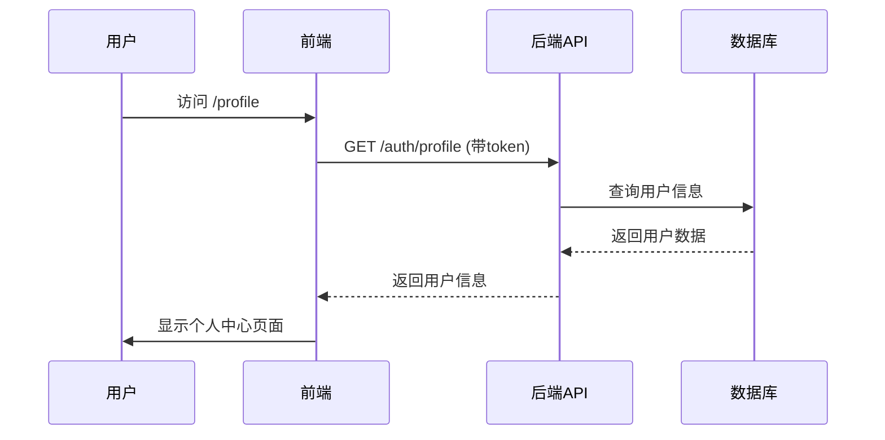
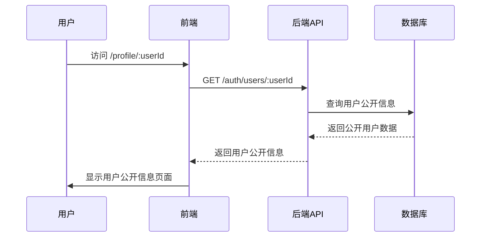
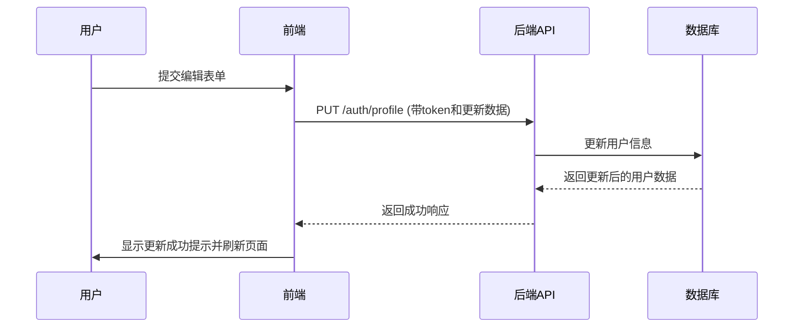

# 个人中心页面设计文档

## 1. 概述

### 1.1 功能目标
设计并实现一个个人中心页面，允许已登录用户查看和编辑个人信息，同时允许其他用户查看公开信息。

### 1.2 核心功能
- 为已登录用户创建个人中心页面，作为登录后的默认页面
- 在首页导航栏添加"个人中心"入口
- 实现用户信息展示和编辑功能
- 支持查看其他用户的公开信息（只读）
- 提供未登录用户访问个人中心时的登录提示
- 允许用户上传头像和背景图
- 允许用户修改用户名

## 2. 架构设计

### 2.1 前端架构

#### 2.1.1 页面结构
```
个人中心页面
├── 用户信息头部
│   ├── 用户头像
│   ├── 用户名和认证状态
│   ├── 个人简介
│   ├── 地理位置和网站链接
│   ├── 加入时间
│   └── 操作按钮（编辑资料/设置）
├── 统计数据卡片
│   ├── 文件数量
│   ├── 总浏览量
│   ├── 总下载量
│   └── 获得点赞
├── 内容标签页
│   ├── 上传的文件
│   ├── 关注者
│   ├── 关注中
│   └── 点赞的文件
└── 编辑资料弹窗
    ├── 个人简介编辑
    ├── 地理位置编辑
    └── 网站链接编辑
```

#### 2.1.2 组件设计
- **UserProfilePage**: 主页面组件
- **ProfileHeader**: 用户信息头部组件
- **StatsCard**: 统计数据卡片组件
- **ContentTabs**: 内容标签页组件
- **EditProfileModal**: 编辑资料弹窗组件
- **AvatarUpload**: 头像上传组件
  - 支持点击上传和拖拽上传
  - 支持图片预览和裁剪
  - 显示上传进度
- **CoverUpload**: 背景图上传组件
  - 支持点击上传和拖拽上传
  - 支持图片预览
  - 显示上传进度
- **UsernameEdit**: 用户名修改组件
  - 实时验证用户名可用性
  - 显示验证结果

### 2.2 后端架构

#### 2.2.1 API端点设计
| 端点 | 方法 | 描述 | 认证要求 |
|------|------|------|----------|
| `/auth/profile` | GET | 获取当前用户信息 | 需要 |
| `/auth/profile` | PUT | 更新用户信息 | 需要 |
| `/auth/users/:userId` | GET | 获取用户公开信息 | 可选 |

#### 2.2.2 数据模型
用户模型字段：
- `_id`: 用户ID
- `username`: 用户名
- `email`: 邮箱
- `avatar`: 头像URL
- `coverImage`: 背景图URL
- `bio`: 个人简介
- `location`: 地理位置
- `website`: 个人网站
- `followers`: 关注者列表
- `following`: 关注列表
- `followersCount`: 关注者数量
- `followingCount`: 关注数量
- `isActive`: 账户是否激活
- `isVerified`: 是否已验证
- `role`: 用户角色
- `lastLoginAt`: 最后登录时间
- `createdAt`: 创建时间
- `preferences`: 用户偏好设置

需要在后端模型中添加 `coverImage` 字段以支持背景图功能。

## 3. 前端实现

### 3.1 路由配置
在 `App.tsx` 中添加个人中心路由：
```typescript
<Route path="/profile" element={<ProtectedRoute><UserProfile /></ProtectedRoute>} />
<Route path="/profile/:userId" element={<UserProfile />} />
```

### 3.2 导航栏修改
在 `GlobalHeader/index.tsx` 中添加个人中心导航项：
```typescript
{isAuthenticated && (
  <a
    href="/profile"
    onClick={(e) => {
      e.preventDefault();
      navigate('/profile');
    }}
    style={linkStyle}
  >
    <span>👤</span>
    个人中心
  </a>
)}
```

### 3.3 页面组件实现

#### 3.3.1 用户信息头部
- 显示用户头像、背景图、用户名、认证状态
- 显示个人简介、地理位置、网站链接
- 显示加入时间
- 根据是否为当前用户显示编辑按钮
- 支持头像和背景图的点击上传功能
- 头像上传组件：点击头像区域可选择新图片
- 背景图上传组件：在背景图区域显示编辑按钮

#### 3.3.2 统计数据展示
- 文件数量统计
- 浏览量统计
- 下载量统计
- 点赞数统计

#### 3.3.3 内容标签页
- 上传的文件：显示用户上传的文件列表
- 关注者：显示关注该用户的用户列表
- 关注中：显示用户关注的用户列表
- 点赞的文件：显示用户点赞的文件列表

#### 3.3.4 编辑资料功能
- 弹窗形式的编辑界面
- 可编辑字段：个人简介、地理位置、网站链接
- 头像上传功能
  - 支持常见图片格式（JPG, PNG, GIF）
  - 限制文件大小（最大2MB）
  - 支持裁剪和预览
- 背景图上传功能
  - 支持常见图片格式（JPG, PNG, GIF）
  - 限制文件大小（最大5MB）
  - 支持预览
- 用户名修改功能
  - 实时验证用户名可用性
  - 格式验证（3-30个字符，只能包含字母、数字和下划线）
- 表单验证和提交处理

### 3.4 权限控制
- 当前用户可以编辑自己的信息
- 其他用户只能查看公开信息
- 未登录用户访问个人中心页面时提示登录

## 4. 后端实现

### 4.1 用户信息获取接口
```javascript
// 获取当前用户信息
GET /auth/profile
// 获取指定用户公开信息
GET /auth/users/:userId
```

需要在用户模型中添加背景图字段：
```javascript
coverImage: {
  type: String,
  default: ''
}
```

### 4.2 用户信息更新接口
```javascript
// 更新当前用户信息
PUT /auth/profile
```

需要添加新的文件上传接口：
```javascript
// 上传头像
POST /auth/upload-avatar

// 上传背景图
POST /auth/upload-cover
```

更新用户名接口：
```javascript
// 更新用户名
PUT /auth/update-username
```

文件处理要求：
- 头像文件处理：调整大小为200x200像素，压缩优化
- 背景图文件处理：调整大小为1920x600像素，压缩优化
- 文件存储：使用云存储或本地存储，生成唯一文件名
- 文件访问：通过CDN或直接URL访问

### 4.3 数据验证
- 头像URL格式验证
- 个人简介长度限制（最多500字符）
- 地理位置长度限制（最多100字符）
- 网站链接格式验证
- 用户名格式验证（3-30个字符，只能包含字母、数字和下划线）
- 用户名唯一性验证
- 用户名修改频率限制（防止频繁修改）

## 5. 数据流设计

### 5.1 用户访问自己的个人中心


### 5.2 用户访问他人的个人中心


### 5.3 用户编辑个人信息


## 6. 安全设计

### 6.1 认证与授权
- 使用JWT令牌进行用户身份验证
- 通过中间件验证访问权限
- 仅允许用户编辑自己的信息
- 文件上传权限验证
- 用户名修改权限验证

### 6.2 数据保护
- 密码字段不在用户信息中返回
- 敏感信息通过权限控制进行保护
- 输入数据进行验证和清理

### 6.3 访问控制
- 未登录用户访问个人中心时重定向到登录页面
- 用户只能查看其他用户的公开信息
- 提供清晰的权限提示信息

## 7. 用户体验设计

### 7.1 界面设计
- 采用与现有网站一致的设计风格
- 使用渐变背景和玻璃态效果
- 响应式设计适配不同设备

### 7.2 交互设计
- 平滑的页面过渡动画
- 直观的操作反馈
- 清晰的信息层级结构
- 头像和背景图的悬停效果提示
- 上传过程中的实时进度反馈
- 用户名修改时的实时验证反馈

### 7.3 可访问性
- 支持键盘导航
- 合适的颜色对比度
- 语义化的HTML结构

## 8. 错误处理

### 8.1 前端错误处理
- 网络请求失败提示
- 表单验证错误显示
- 用户不存在时的友好提示

### 8.2 后端错误处理
- 用户未找到错误
- 权限不足错误
- 数据验证错误
- 服务器内部错误

## 9. 性能优化

### 9.1 数据加载优化
- 使用加载状态提示
- 实现分页加载大量数据
- 缓存用户信息减少重复请求

### 9.2 图片优化
- 头像图片懒加载
- 响应式图片尺寸
- 适当的图片压缩
- 背景图的渐进式加载
- CDN加速图片访问

## 10. 测试策略

### 10.1 单元测试
- 用户信息展示组件测试
- 编辑表单验证测试
- 权限控制逻辑测试

### 10.2 集成测试
- 用户信息获取接口测试
- 用户信息更新接口测试
- 认证流程测试

### 10.3 端到端测试
- 个人中心页面访问流程测试
- 个人信息编辑流程测试
- 权限控制测试