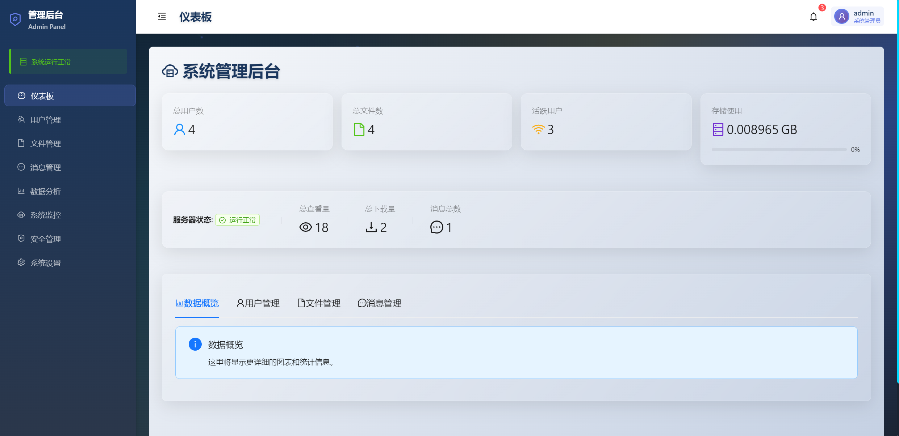

# 镜瞳OVO文件管理社交平台

一个集文件管理与社交互动于一体的Web平台，为用户提供安全便捷的文件存储分享服务和实时社交体验。

## 项目结构

```
file-social-platform/
├── frontend/           # React前端应用
│   ├── src/
│   │   ├── components/ # 可复用组件
│   │   ├── pages/      # 页面组件
│   │   ├── store/      # Redux状态管理
│   │   ├── hooks/      # 自定义Hooks
│   │   ├── utils/      # 工具函数
│   │   ├── types/      # TypeScript类型定义
│   │   ├── styles/     # 样式文件
│   │   └── assets/     # 静态资源
│   └── public/         # 公共静态文件
├── backend/            # Node.js后端API
│   ├── src/
│   │   ├── models/     # 数据模型
│   │   ├── routes/     # 路由定义
│   │   ├── controllers/# 控制器
│   │   ├── middleware/ # 中间件
│   │   ├── services/   # 业务逻辑
│   │   ├── config/     # 配置文件
│   │   └── utils/      # 工具函数
│   └── uploads/        # 文件上传目录
└── docker-compose.yml  # Docker编排文件
```

## 核心功能

### 文件管理
- 多种文件类型支持（图片、视频、音频、文档）
- 文件上传下载
- 文件搜索和过滤
- 缩略图生成
- 文件分享

### 社交功能
- 用户注册登录
- 个人主页
- 好友搜索和关注
- 实时聊天
- 用户互动

### AI智能聊天助手
- 基于规则的智能对话系统
- 可解答用户关于平台使用的问题
- 保存聊天历史记录
- 与现有用户认证系统集成

### 管理后台
- 管理员登录认证
- 用户管理
- 文件管理
- 系统监控
- 数据分析
- 安全管理
- 系统设置

### 用户体验
- 响应式设计
- 炫酷动画效果
- 粒子背景系统
- 流畅的页面过渡
- 自定义鼠标效果

## 技术栈

### 前端
- React 18+ + TypeScript
- Redux Toolkit + RTK Query
- Ant Design + Styled Components
- Framer Motion + Three.js
- React Router v6

### 后端
- Node.js + Express.js
- MongoDB + Redis
- Socket.io
- JWT + Passport.js
- Multer (文件上传)
- AI聊天服务模块：用于处理用户与AI助手的交互

## 🚀 快速开始

### 方法一：使用Docker（推荐）
```bash
# 克隆项目
git clone https://github.com/BronyaEden/my-project.git
cd file-social-platform

# 配置环境变量
cp backend/.env.example backend/.env
# 编辑 backend/.env 文件，修改数据库密码和JWT密钥

# 启动所有服务
docker-compose up -d

# 访问应用
# 前端: http://localhost:3000
# 后端API: http://localhost:5000/api
```

### 方法二：本地开发（手动安装依赖）

**Windows用户可以使用我们提供的脚本快速设置：**
```bash
# 运行设置脚本（会自动安装所有依赖）
setup-dev-environment.bat
```

**或者手动安装：**

1. **安装后端依赖**
```bash
cd backend
npm install
```

2. **安装前端依赖**
```bash
cd frontend
npm install
```

### 方法三：本地开发（不使用Docker数据库）

如果您选择不在Docker中运行数据库服务，则需要在本地安装MongoDB和Redis。

#### 安装MongoDB

1. 访问 MongoDB 官方下载页面: https://www.mongodb.com/try/download/community
2. 选择以下选项：
   - Version: 最新稳定版本
   - Platform: Windows x64
   - Package: msi
3. 点击 "Download" 下载安装文件
4. 双击下载的 `.msi` 文件开始安装，按默认选项完成安装

#### 安装Redis

1. 访问 https://github.com/microsoftarchive/redis/releases
2. 下载最新的 `Redis-x64-*.msi` 文件
3. 双击下载的 `.msi` 文件开始安装，按默认选项完成安装

#### 启动数据库服务

```bash
# 启动MongoDB服务（Windows服务方式）
net start MongoDB

# 启动Redis服务（如果安装为服务）
net start Redis

# 或者直接运行Redis服务器
redis-server
```

#### 配置环境变量

确保 [backend/.env](backend/.env) 和 [frontend/.env](frontend/.env) 文件配置正确，指向本地数据库。

#### 启动开发服务器

```bash
# 启动后端服务
cd backend
npm run dev

# 在新终端中启动前端服务
cd frontend
npm run dev
```

**！！！Windows用户可以使用我们提供的启动脚本：**
```bash
# 运行启动脚本（会同时启动前后端服务）
start-dev.bat
```

## 使用工具脚本

为了简化开发流程，我们提供了几个实用的脚本：

### Windows用户

1. **设置开发环境**
```cmd
setup-dev-environment.bat
```
这个脚本会自动安装前后端的所有依赖。

2. **启动开发服务器**
```cmd
start-dev.bat
```
这个脚本会同时启动前后端开发服务器。

3. **Docker开发环境**
```cmd
docker-dev.bat
```
这个脚本会使用Docker启动所有服务。

4. **健康检查**
```cmd
npm run health
```
或者直接运行：
```cmd
node health-check.js
```
这个脚本会检查所有服务是否正常运行。

## 📖 详细部署说明

查看 [DEPLOYMENT.md](./DEPLOYMENT.md) 获取完整的部署指南，包括：
- 生产环境配置
- SSL/HTTPS设置
- 性能优化
- 监控和维护
- 故障排除

## 环境要求

- Node.js >= 18
- MongoDB >= 5.0
- Redis >= 6.0

## 开发规范

- 使用TypeScript进行类型检查
- 组件使用函数式组件 + Hooks
- 样式使用Styled Components
- 提交代码前运行ESLint和Prettier
- 编写单元测试和集成测试

## 📸 项目截图

> 注：实际界面可能与截图有所差异，以最新版本为准

### 首页


### 文件浏览


### 聊天界面


### 管理后台


## 🎯 开发状态

### ✅ 已完成功能
- [x] 项目基础架构搭建
- [x] 前端UI框架和路由配置
- [x] 后端API基础框架
- [x] 数据库模型设计
- [x] 用户认证系统（注册/登录）
- [x] Redux状态管理配置
- [x] Docker容器化部署
- [x] 基础组件和页面结构
- [x] 文件上传和管理系统
- [x] 实时聊天功能
- [x] 管理员面板
- [x] 用户个人资料页面完善
- [x] 社交互动功能（关注）

### 🚧 开发中功能
- [ ] AI聊天助手功能
- [ ] 文件搜索和过滤优化
- [ ] 移动端适配优化

### 📋 待开发功能
- [ ] 文件预览功能
- [ ] 高级搜索
- [ ] 通知系统
- [ ] 国际化支持

## 🤝 贡献指南

欢迎提交问题和功能请求！如果您想为项目做出贡献：

1. Fork 本仓库
2. 创建您的特性分支 (`git checkout -b feature/AmazingFeature`)
3. 提交您的修改 (`git commit -m 'Add some AmazingFeature'`)
4. 推送到分支 (`git push origin feature/AmazingFeature`)
5. 打开一个 Pull Request

### 开发规范

- 使用 ESLint 和 Prettier 进行代码格式化
- 遵循 TypeScript 严格模式
- 编写单元测试和集成测试
- 提交信息使用约定式提交格式

## 📞 支持和反馈

- **文档**: 查看项目Wiki获取详细文档
- **问题报告**: 通过GitHub Issues报告bug
- **功能请求**: 通过GitHub Issues提交新功能建议
- **讨论**: 加入GitHub Discussions参与讨论

## 🙏 致谢

感谢以下开源项目的支持：

- [React](https://reactjs.org/) - 前端框架
- [Node.js](https://nodejs.org/) - 后端运行环境
- [MongoDB](https://www.mongodb.com/) - 数据库
- [Ant Design](https://ant.design/) - UI组件库
- [Socket.io](https://socket.io/) - 实时通信
- [Docker](https://www.docker.com/) - 容器化部署

## 📄 许可证

MIT License - 查看 [LICENSE](./LICENSE) 文件了解详情

---

**⭐ 如果这个项目对您有帮助，请不要忘记给它一个星标！**